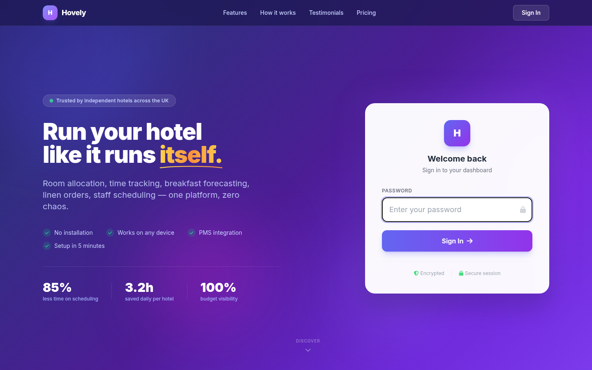
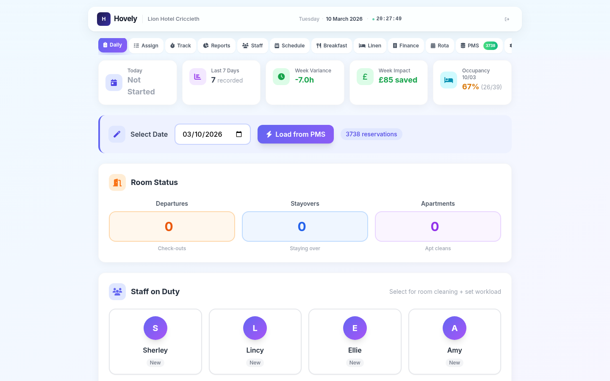
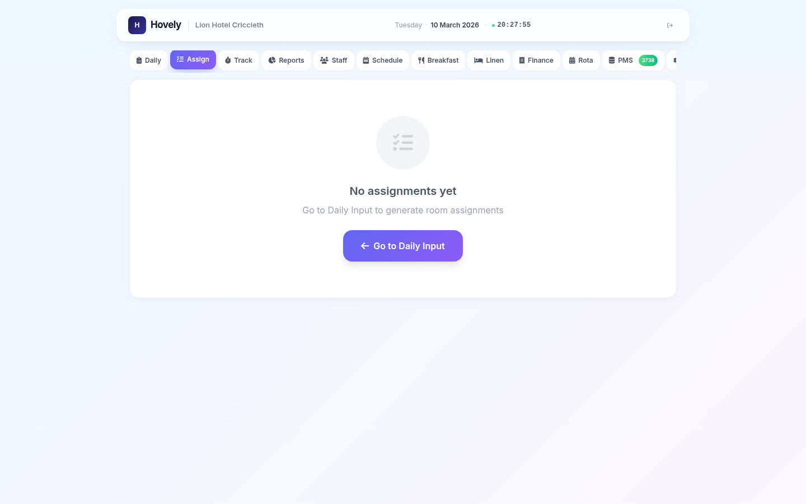
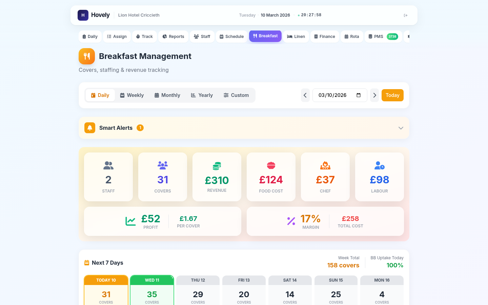
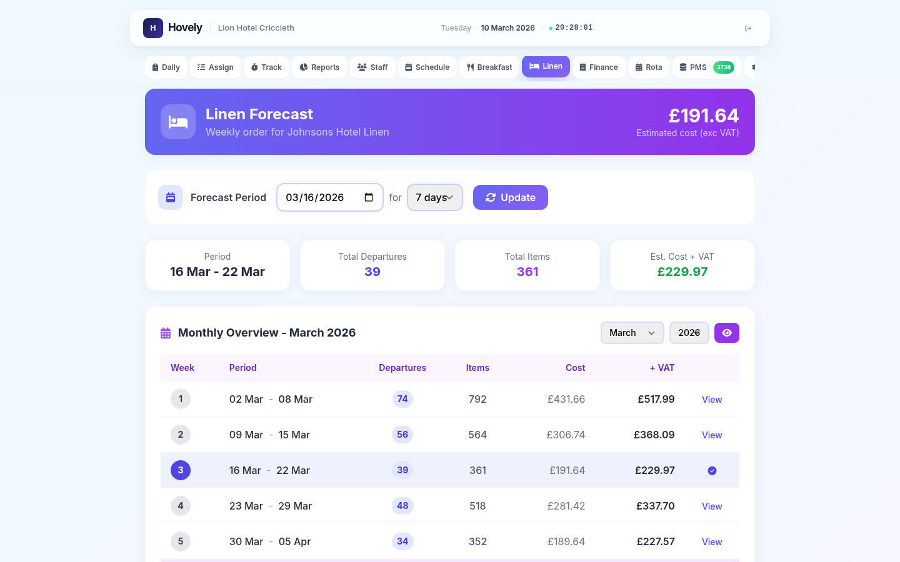
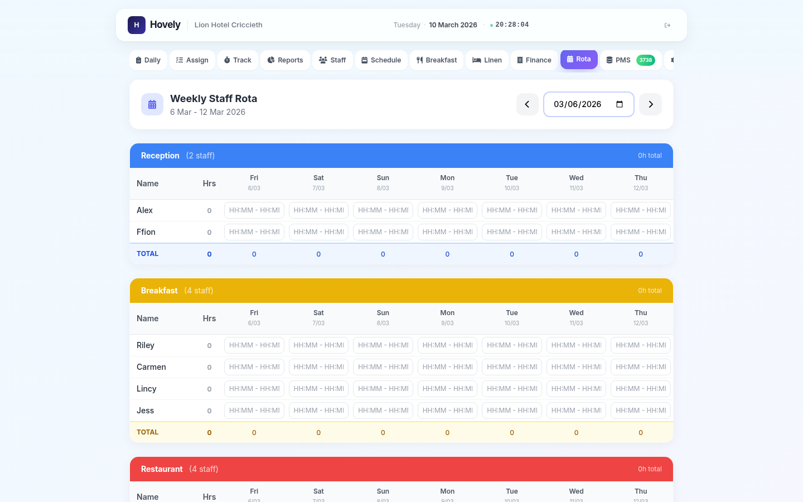
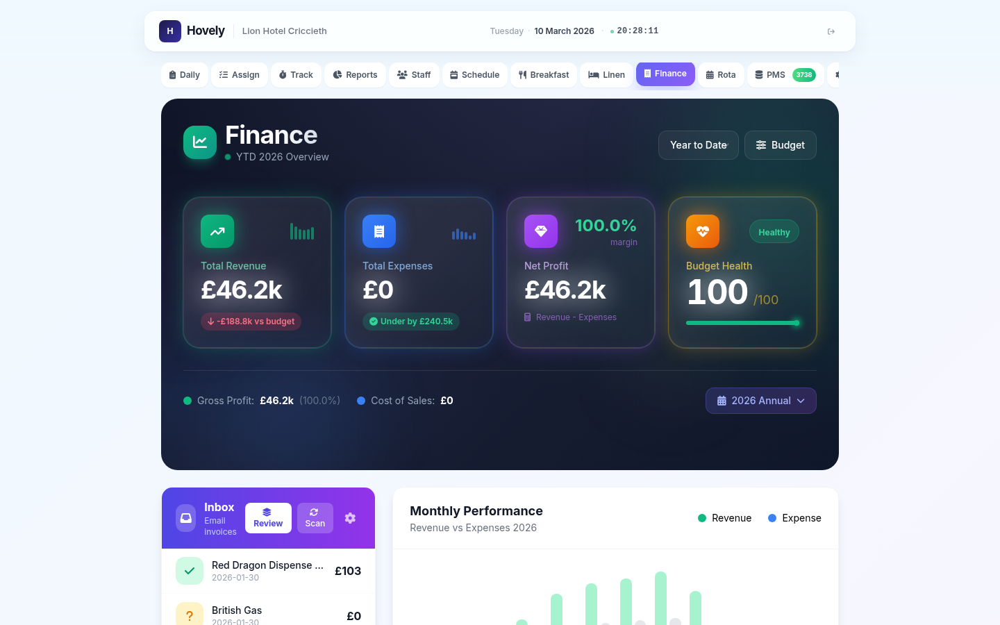
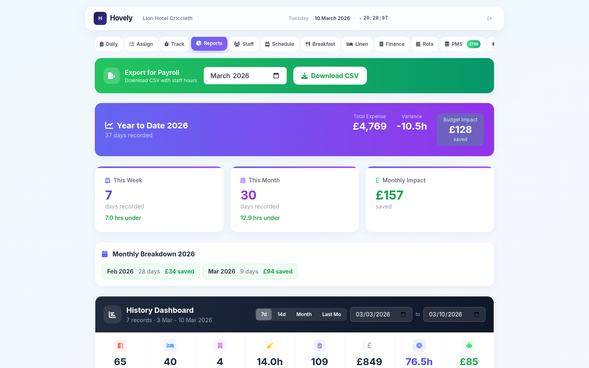
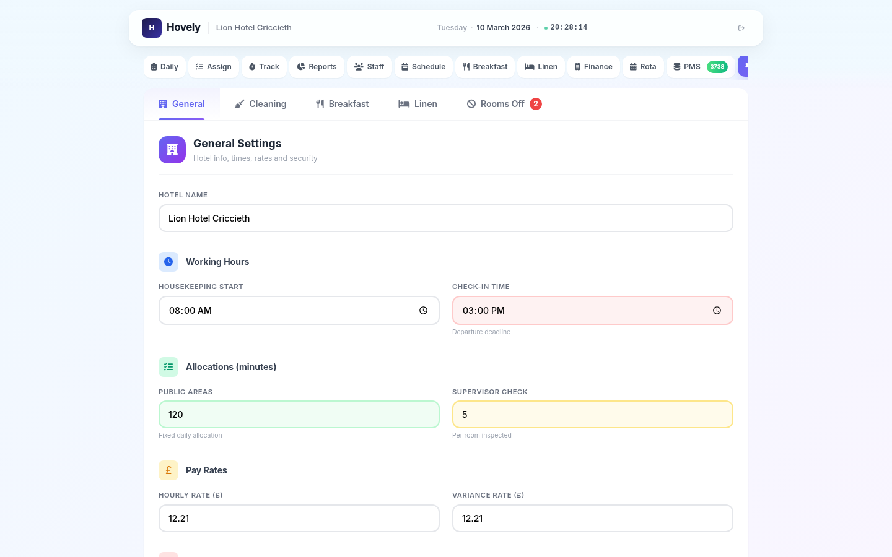
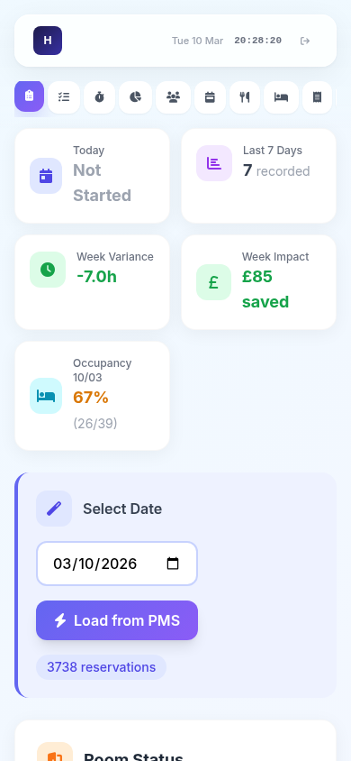

<p align="center">
  
</p>

<h1 align="center">Hovely</h1>

<p align="center">
  <strong>Hotel operations platform for housekeeping allocation, breakfast forecasting, linen management, staff rota scheduling, and financial P&L tracking — powered by Vision AI.</strong>
</p>

<p align="center">
  
  
  
  
  
  
  
  
</p>

<p align="center">
  <a href="#screenshots">Screenshots</a> &bull;
  <a href="#features">Features</a> &bull;
  <a href="#tech-stack">Tech Stack</a> &bull;
  <a href="#architecture">Architecture</a> &bull;
  <a href="#vision-ai-engine">Vision AI Engine</a> &bull;
  <a href="#security">Security</a>
</p>

---

## Screenshots

### Login
<p align="center">
  
</p>

> Secure single-password authentication with bcrypt hashing, 5-attempt lockout (15 minutes), and session-based access. Dark-themed login branded per hotel.

### Dashboard — Daily Allocation
<p align="center">
  
</p>

> Quick stats with today's allocation, 7-day variance trend, and occupancy percentage. Enter departures, stayovers, and apartments to calculate total housekeeping hours. Load directly from PMS reservations for the selected date.

### Staff Assignments
<p align="center">
  
</p>

> Automatic load-balanced room distribution across available housekeeping staff. Rooms sorted by priority (departures first), then grouped by floor to minimise walking. Click to manually reassign rooms between staff.

### Breakfast Forecast
<p align="center">
  
</p>

> Daily, weekly, and monthly breakfast cover forecasting from PMS reservation data. Calculates revenue, staffing needs, chef hours, food costs, and profit per period. Covers pulled from guest bookings with breakfast included.

### Linen Management
<p align="center">
  
</p>

> 7-to-90-day linen order forecasting based on occupancy. Par levels per room type, supplier integration, unit pricing, and cost estimation. Weekly and monthly views with order history tracking.

### Staff Rota
<p align="center">
  
</p>

> Interactive 7-day grid scheduler with shift entry, status tracking (OFF, Sick, Holiday, Training, Standby, Emergency), contract hour summaries, and print-ready output. Mobile-friendly card-based interface with light/dark themes.

### Finance & P&L
<p align="center">
  
</p>

> Full P&L dashboard with Revenue, Cost of Sales, Gross Profit, Admin Costs, and Operating Profit. Upload invoices as images or PDFs — Vision AI extracts supplier, amount, date, and category automatically. Budget vs. actual variance tracking with YTD, monthly, and quarterly views.

### Reports & Analytics
<p align="center">
  
</p>

> Daily variance reports (actual hours vs. allocation), staff hours breakdown by department, room cleaning analysis by type, weekly/monthly rollups, occupancy trends, cost per room cleaned, and forecast accuracy tracking.

### Settings
<p align="center">
  
</p>

> Configure hotel name, cleaning times per room type (single 30min to apartment 60min), hourly rates, shift start times, departure deadlines, breakfast pricing, and IMAP email credentials for automated invoice fetching.

### Mobile Responsive
<p align="center">
  
</p>

---

## Features

### Daily Room Allocation
- **Allocation calculation** — departures × room-type time + stayovers × 10min + apartments × 60min + public areas
- **Room-type-specific times** — Single (30min), Double/King (35min), Twin (40min), Family 3-bed (45min), Family 4-bed (50min), Family 5-bed/Apartment (60min)
- **PMS integration** — load departures and stayovers directly from imported reservations for any date
- **Quick stats** — today's status, 7-day variance trend, occupancy percentage
- **Manual overrides** — skip public areas or supervisor inspection as needed
- **Supervisor calculation** — optional inspection time per room

### Staff Assignments
- **Load-balanced distribution** — greedy algorithm assigns each room to the staff member with the lowest current load
- **Priority sorting** — departures (highest) → stayovers → apartments (lowest)
- **Floor grouping** — rooms grouped by floor within priority to minimise walking distance
- **Manual reassignment** — click any room to move it between staff members
- **Per-staff summary** — total hours, room list with individual times

### Breakfast Forecasting
- **Covers from PMS** — adults + children with breakfast included, pulled from reservations
- **Revenue calculation** — covers × configurable price per cover (default £10.00)
- **Staffing formula** — ceil(covers ÷ 25) staff × 4-hour shift × hourly rate
- **Chef cost** — 3-hour shift × hourly rate
- **Food cost** — covers × £4.00 per cover
- **Profit tracking** — revenue minus total costs
- **View modes** — daily, weekly, monthly, and custom date range

### Linen Management
- **Forecast periods** — 7, 14, 21, 30, 60, 90 days
- **Par levels** — configurable per room type (single, double, family, apartment)
- **Item tracking** — sheets, pillowcases, towels, bath mats, cloths
- **Supplier details** — name, contact, delivery days, unit prices
- **Cost estimation** — item quantity × unit price
- **Order history** — view and track past linen orders

### Staff Rota Scheduling
- **Interactive grid** — rows = staff, columns = days (Fri–Thu week)
- **Shift statuses** — OFF, Sick, Holiday, Training, Standby, Emergency
- **Contract hours** — automatic weekly hour summation per staff member
- **Department auto-scheduling** — calculator suggests minimum staff per department
- **Version control** — save with timestamp, rename, duplicate, download JSON
- **Print mode** — formatted CSS for paper output with theme preservation
- **Mobile UI** — tap cards for touch-friendly shift editing
- **Backup retention** — 30-day auto-cleanup of old versions

### Finance & P&L Dashboard
- **Invoice capture** — upload photo/PDF, Vision AI extracts supplier, amount, date, category
- **PDF support** — automatic conversion via pdftoppm (300 DPI) + pdftotext for context
- **Smart categorisation** — supplier history learning for automatic category assignment
- **Budget management** — set monthly budgets per category (Revenue, COGS, Admin, Finance)
- **P&L statement** — Revenue − Cost of Sales − Admin Costs − Finance Costs = Operating Profit
- **Variance tracking** — actual vs. budget with YTD, monthly, and quarterly views
- **Revenue entries** — manual recording of room revenue, F&B, and ancillary income
- **Time ranges** — YTD, This Month, Last Month, Q1–Q4

### Email Invoice Automation
- **IMAP integration** — connect to any email inbox (configurable host, port, SSL)
- **Keyword search** — scans for "invoice", "bill", "statement", "payment due"
- **Attachment extraction** — PDF, PNG, JPG, GIF, WEBP
- **AI parsing** — Groq Vision reads extracted images for supplier, amount, date
- **Approval queue** — pending invoices reviewed before committing to ledger
- **Line-item detection** — split multi-category invoices across departments
- **Duplicate prevention** — tracks processed email IDs
- **Supplier learning** — remembers supplier → category mappings

### PMS Integration
- **CSV import** — upload HOP PMS "Arrivals" report
- **Column parsing** — Room, Guest, Arrival, Departure, Room Type
- **Room classification** — automatic mapping (Apartment/Studio → 60min, others by type)
- **Image parsing** — upload PMS report screenshot, Vision AI extracts reservation data
- **Date-based loading** — populate daily allocation from imported reservations

### Reports & Analytics
- **Daily variance** — actual hours vs. allocation with monetary impact
- **Staff hours** — breakdown by department and individual
- **Room cleaning analysis** — actual time per room type
- **Weekly/monthly rollups** — cumulative hours, costs, variance
- **Occupancy trends** — over selected period
- **Cost per room cleaned** — variance analysis
- **Forecast accuracy** — actual vs. predicted allocations

### Staff Management
- **Staff CRUD** — add, edit, delete with confirmation
- **Departments** — HSK, Reception, Breakfast, Restaurant, BBQ, Bar, Kitchen, Maintenance
- **Custom rates** — per-staff hourly rate override (falls back to hotel default)
- **Color-coded badges** — department identification at a glance

### Tracking & Time Input
- **Manual time recording** — actual hours per staff member per task type
- **Task categories** — departures, stayovers, apartments, public areas, supervisor
- **Variance calculation** — compares actual vs. allocated time

---

## Tech Stack

### Backend
| Technology | Purpose |
|---|---|
| **PHP 8.2** | Server-side runtime and API handlers |
| **JSON file storage** | Persistent data layer (15 data files) |
| **bcrypt** | Password hashing via `password_hash()` |
| **IMAP extension** | Automated email invoice fetching |
| **cURL extension** | External API calls (Groq, Cerebras) |
| **Poppler tools** | PDF → image conversion (pdftoppm, pdftotext) |

### AI Providers (2)
| Provider | Model | Use Case |
|---|---|---|
| **Groq** (Primary) | Llama 3.2 Vision | Invoice image parsing, PMS report extraction |
| **Cerebras** (Fallback) | Free tier | Cost-optimised fallback for text extraction |

### Frontend
| Technology | Purpose |
|---|---|
| **Vanilla JavaScript** | Client-side interactivity — no framework overhead |
| **Tailwind CSS** (CDN) | Utility-first responsive styling |
| **Font Awesome 6** | Icon library |
| **Inter** | Typography (Google Fonts) |
| **PHP templating** | Server-rendered HTML with embedded data |

### Rota Module
| Technology | Purpose |
|---|---|
| **Standalone JavaScript** | ~1,500 lines — interactive grid scheduler |
| **CSS print styles** | Print-ready rota output |
| **REST API** | PHP backend for save/load/list/delete/rename |
| **JSON versioning** | 60+ historical rota snapshots with 30-day retention |

### Infrastructure
| Technology | Purpose |
|---|---|
| **Apache / Nginx** | Web server with PHP |
| **Session storage** | File-based PHP sessions |
| **File-based rate limiting** | Login attempt tracking with lockout |
| **JSON persistence** | Zero-dependency data storage |

---

## Architecture

### System Overview

```
┌─────────────────────────────────────────────────────────────────┐
│                     HOVELY FRONTEND                              │
│  ┌──────────┐  ┌──────────┐  ┌──────────┐  ┌───────────────┐  │
│  │  Daily   │  │Breakfast │  │  Finance  │  │    Rota       │  │
│  │ Allocate │  │ Forecast │  │  P&L      │  │  Scheduler    │  │
│  │ Assign   │  │ Revenue  │  │  Invoices │  │  Grid Editor  │  │
│  │ Variance │  │ Staffing │  │  Budget   │  │  Print/Mobile │  │
│  └────┬─────┘  └────┬─────┘  └────┬─────┘  └───────┬───────┘  │
│       └──────────────┼──────────────┼───────────────┘           │
│                      │  POST / JSON API                         │
└──────────────────────┼───────────────────────────────────────────┘
                       │
┌──────────────────────┼───────────────────────────────────────────┐
│              PHP APPLICATION (32 Files, 13 Tabs)                 │
│                      │                                           │
│  ┌───────────────────┴────────────────────┐                     │
│  │       index.php → Router/Handlers      │                     │
│  │  includes/handlers.php (25+ actions)   │                     │
│  │  handlers/ (finance, email, PMS)       │                     │
│  │  rota/rota_api.php (10 endpoints)      │                     │
│  └──┬───────┬────────┬────────┬──────────┘                     │
│     │       │        │        │                                  │
│  ┌──┴───┐ ┌─┴─────┐ ┌┴──────┐ ┌┴────────┐                     │
│  │Alloc.│ │Breakfast│ │Finance│ │  Rota   │                     │
│  │Assign│ │Linen  │ │Invoice│ │Schedule │                       │
│  │Rooms │ │Covers │ │Budget │ │Version  │                       │
│  │Staff │ │Cost   │ │P&L    │ │Backup   │                       │
│  └──┬───┘ └──┬────┘ └──┬───┘ └──┬──────┘                      │
│     │        │         │        │                                │
│  ┌──┴────────┴─────────┴────────┴────────┐                     │
│  │          Service Layer                 │                     │
│  │  functions.php · finance_functions.php │                     │
│  │  ai_helper.php · data.php · auth.php  │                     │
│  │  email_invoice_processor.php          │                     │
│  └──────────────────┬────────────────────┘                      │
│                     │                                            │
└─────────────────────┼────────────────────────────────────────────┘
                      │
       ┌──────────────┼──────────────┐
       │              │              │
  ┌────┴────┐   ┌────┴────┐   ┌────┴────────┐
  │  JSON   │   │ Vision  │   │  External   │
  │  Files  │   │   AI    │   │  Services   │
  │ 15 data │   │  Groq   │   │ IMAP Email  │
  │  files  │   │ Llama   │   │ HOP PMS     │
  │records  │   │ 3.2     │   │ (CSV/Image) │
  │reserv.  │   │Cerebras │   │             │
  │invoices │   │(fallbk) │   │             │
  └─────────┘   └─────────┘   └─────────────┘
```

### Data Flow — Daily Allocation

```
PMS CSV Import or Image Upload
       │
       ▼
  ┌──────────┐    ┌──────────────┐    ┌─────────────────┐
  │ CSV Parse │    │  Vision AI   │    │  reservations   │
  │ or AI     │───▶│  Extract     │───▶│  .json          │
  │ Extract   │    │  Rooms/Dates │    │  (56K+ lines)   │
  └──────────┘    └──────────────┘    └────────┬────────┘
                                               │
                                               ▼
                                      ┌─────────────────┐
                                      │  Load Date      │
                                      │  Count deps,    │
                                      │  stayovers,     │
                                      │  apartments     │
                                      └────────┬────────┘
                                               │
                              ┌────────────────┼────────────────┐
                              ▼                ▼                ▼
                       ┌───────────┐    ┌───────────┐    ┌──────────┐
                       │ Calculate │    │  Assign   │    │  Save    │
                       │ Allocation│    │  Rooms to │    │  Record  │
                       │ (hours)   │    │  Staff    │    │  + Var.  │
                       └───────────┘    └───────────┘    └──────────┘
```

### Data Flow — Invoice Processing

```
Invoice arrives (Upload or Email)
       │
       ├── PDF? ──▶ pdftoppm (300 DPI) ──▶ Image
       │                                     │
       ▼                                     ▼
  ┌──────────────┐                  ┌─────────────────┐
  │  Image File  │─────────────────▶│  Groq Vision    │
  │  (JPG/PNG)   │                  │  Llama 3.2      │
  └──────────────┘                  │  "Extract:      │
                                    │   supplier,     │
                                    │   amount, date, │
                                    │   category"     │
                                    └────────┬────────┘
                                             │
                                    ┌────────┴────────┐
                                    │  Supplier       │
                                    │  Learning       │
                                    │  (category map) │
                                    └────────┬────────┘
                                             │
                              ┌──────────────┼──────────────┐
                              ▼              ▼              ▼
                       ┌───────────┐  ┌───────────┐  ┌──────────┐
                       │  Pending  │  │  Approve  │  │  P&L     │
                       │  Queue    │─▶│  / Reject │─▶│  Ledger  │
                       └───────────┘  └───────────┘  └──────────┘
```

### Key Architectural Patterns

**Tab-Based SPA** — Single PHP entry point (`index.php`) renders `layout.php` with 13 switchable tab templates. All navigation happens client-side via tab switching, with POST handlers processing form submissions.

**JSON File Persistence** — Zero database dependency. 15 JSON files in `/data/` store all operational data. File-level locking (`LOCK_EX`) prevents write conflicts. Suitable for single-hotel operation with <10,000 reservations/year.

**Vision AI Pipeline** — Invoice and PMS images are sent to Groq's Llama 3.2 Vision model via base64 encoding. PDFs are first converted to images (pdftoppm at 300 DPI) with text extracted (pdftotext) as supplementary context. Cerebras provides a free-tier fallback.

**Supplier Learning** — Each approved invoice trains a supplier → category mapping stored in `learned_suppliers.json`. Future invoices from the same supplier are auto-categorised, reducing manual work over time.

**Load-Balanced Assignment** — Room distribution uses a greedy algorithm: sort rooms by priority (departures first), then by floor. Assign each room to the staff member with the lowest current cumulative load. This minimises variance across staff.

**Rota Module Isolation** — The scheduling system operates as a semi-independent sub-application with its own REST API, JavaScript codebase, CSS themes, and JSON storage. Embedded in the main layout via iframe or tab content.

---

## Vision AI Engine

Hovely uses Vision AI to eliminate manual data entry for two critical workflows:

### Invoice Parsing

| Feature | Detail |
|---|---|
| **Primary Model** | Groq — Llama 3.2 Vision |
| **Fallback Model** | Cerebras (free tier) |
| **Input Formats** | JPEG, PNG, GIF, WEBP, PDF |
| **PDF Pipeline** | pdftoppm (300 DPI) → image + pdftotext → context |
| **Extracted Fields** | Supplier name, total amount, date, category, line items |
| **Output** | Structured JSON for approval queue |

### Smart Categorisation

```
┌───────────────────────────────────┐
│         Invoice Image             │
└──────────────┬────────────────────┘
               │
               ▼
┌───────────────────────────────────┐
│  Groq Vision API (Llama 3.2)     │
│                                   │
│  System Prompt:                   │
│  "Analyse this invoice.           │
│   Determine EXPENSE or REVENUE.   │
│   Common suppliers:               │
│   - Booking.com → ota_commission  │
│   - Harlech Food → food_supplies  │
│   - Dwyfor Coffee → food_supplies │
│   - Utilities → utilities         │
│   - Insurance → insurance         │
│                                   │
│   Return JSON: {supplier, amount, │
│     category, date, line_items}"  │
└──────────────┬────────────────────┘
               │
               ▼
┌───────────────────────────────────┐
│  learned_suppliers.json           │
│  { "Harlech": "food_supplies",   │
│    "Booking.com": "ota_commission"│
│    ... }                          │
│  Auto-updated on each approval    │
└───────────────────────────────────┘
```

### PMS Report Parsing

Upload a screenshot of a PMS report (HOP PMS or similar) and Vision AI extracts:
- Room numbers, guest names, arrival/departure dates
- Room types with automatic classification
- Number of adults, children, infants
- Breakfast inclusion status

---

## Security

| Layer | Implementation |
|---|---|
| **Authentication** | Single hotel password with bcrypt hashing (`password_hash`) |
| **Brute Force Protection** | 5 failed attempts → 15-minute lockout (file-based tracking) |
| **Session Management** | PHP sessions with `$_SESSION['authenticated']` flag |
| **Password Migration** | Automatic plain text → bcrypt upgrade on first login |
| **Input Sanitisation** | `strip_tags()`, `trim()`, `htmlspecialchars()` on all inputs |
| **File Upload Validation** | Type checking, size limits, safe filename generation |
| **API Key Storage** | Server-side config file (not exposed to client) |
| **File Locking** | `LOCK_EX` on all JSON writes to prevent corruption |
| **IMAP Security** | SSL/TLS encrypted email connections |

---

## Project Structure

```
hovely/
├── index.php                      # Entry point (router + session)
├── favicon.svg                    # Branding asset
├── includes/                      # Core business logic (10 files)
│   ├── config.php                 # Constants, API keys, data paths
│   ├── auth.php                   # Login, password verification, lockout
│   ├── data.php                   # JSON file read/write utilities
│   ├── functions.php              # Allocation, assignments, linen (1,523 lines)
│   ├── finance_functions.php      # Budget, invoices, revenue (666 lines)
│   ├── ai_helper.php              # Groq/Cerebras Vision API (558 lines)
│   ├── email_invoice_processor.php # IMAP email fetching & parsing (456 lines)
│   ├── handlers.php               # POST request routing (991 lines)
│   └── page_data.php              # Template data preparation
├── handlers/                      # External API handlers
│   ├── pms_handler.php            # PMS report image parsing (289 lines)
│   ├── finance_handler.php        # Invoice upload & categorisation (251 lines)
│   └── email_handler.php          # Email invoice automation (212 lines)
├── templates/                     # View layer
│   ├── layout.php                 # Main UI container, tab navigation (817 lines)
│   ├── home.php                   # Login page (687 lines)
│   ├── partials/
│   │   └── invoice_card.php       # Reusable invoice card component
│   └── tabs/                      # 13 feature modules
│       ├── daily.php              # Daily room allocation (546 lines)
│       ├── assignments.php        # Staff assignment editor (434 lines)
│       ├── breakfast.php          # Breakfast forecasting (1,359 lines)
│       ├── linen.php              # Linen order forecasting (395 lines)
│       ├── rota.php               # Staff scheduling UI (776 lines)
│       ├── schedule.php           # Weekly workload preview (252 lines)
│       ├── tracking.php           # Manual time tracking (221 lines)
│       ├── reports.php            # P&L, variance, hourly analysis (1,219 lines)
│       ├── staff.php              # Staff CRUD (118 lines)
│       ├── settings.php           # Hotel configuration (657 lines)
│       ├── import.php             # PMS CSV upload (81 lines)
│       ├── finance.php            # Premium P&L dashboard (2,958 lines)
│       └── finance_budget.php     # Budget entry & management (369 lines)
├── rota/                          # Staff scheduling sub-module
│   ├── rota.html                  # Interactive rota interface
│   ├── full.html                  # Full-page rota view
│   ├── rota_api.php               # REST API (save, load, list, delete, rename)
│   ├── rota-script.js             # Client-side logic (~1,500 lines)
│   ├── main-styles.css            # Theme & design tokens
│   ├── control-panel.css          # Rota-specific styling
│   ├── print-styles.css           # Print-friendly CSS
│   └── rota_data/                 # 60+ historical rota snapshots
├── data/                          # JSON data persistence (15 files)
│   ├── settings.json              # Hotel config, timings, rates, password
│   ├── staff.json                 # Staff list with departments and rates
│   ├── records.json               # Daily allocation records (~8,400 lines)
│   ├── reservations.json          # PMS guest bookings (~56,000 lines)
│   ├── rooms.json                 # Room definitions (number, type, floor)
│   ├── rooms_off.json             # Rooms out of service
│   ├── linen_config.json          # Supplier info, item costs, par levels
│   ├── linen_orders.json          # Linen order history
│   ├── finance_budget.json        # Annual budget by category/month
│   ├── finance_invoices.json      # Captured invoices
│   ├── finance_revenue.json       # Manual revenue entries
│   ├── login_attempts.json        # Failed login tracking
│   ├── email_settings.json        # IMAP credentials
│   ├── pending_invoices.json      # Awaiting approval
│   ├── learned_suppliers.json     # Supplier → category mappings
│   └── processed_emails.json      # Email IDs already parsed
└── uploads/
    └── invoices/                  # Uploaded invoice PDFs/images
```

---

## Codebase Statistics

| Metric | Value |
|---|---|
| **Total Lines of Code** | 28,392 |
| **PHP (Backend + Views)** | ~18,000 lines (32 files) |
| **JavaScript (Rota)** | ~1,500 lines |
| **Feature Tabs** | 13 |
| **Core Modules** | 10 (includes/) |
| **API Handlers** | 3 (handlers/) |
| **API Endpoints** | 40+ |
| **Data Files** | 15 (JSON) |
| **Total Functions** | 113+ |
| **Rota Versions** | 60+ (historical snapshots) |
| **Reservation Records** | 56,000+ lines |

---

## Performance

- **Zero-framework frontend** — vanilla JavaScript with no React/Vue overhead, instant interactions
- **JSON file storage** — zero database dependency, no connection overhead, simple deployment
- **File-level locking** — `LOCK_EX` prevents write conflicts without database transactions
- **Server-side rendering** — PHP templating delivers complete HTML, no client-side hydration delay
- **Lazy tab loading** — only the active tab's data is computed and rendered
- **Vision AI batching** — PDFs converted once at 300 DPI, pdftotext context sent alongside image for accuracy
- **Supplier learning** — reduces AI API calls over time as categories auto-resolve from history
- **Rota versioning** — 30-day auto-cleanup prevents unbounded storage growth

---

<p align="center">
  <strong>Built by <a href="https://github.com/xelauvas">xelauvas.dev</a></strong>
</p>

<p align="center">
  <sub>This repository contains only documentation. Source code is proprietary.</sub>
</p>
